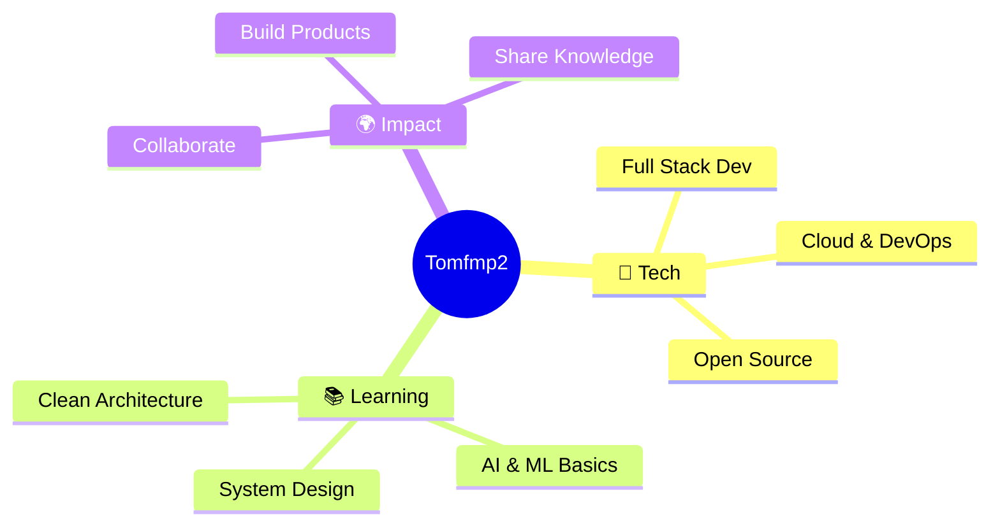

<div align="center">

<!-- Animated Header Wave -->


<!-- Typing SVG Animation -->
<a href="https://git.io/typing-svg">
  
</a>

<br/>

<!-- Profile Views & Social Badges -->

&nbsp;
<a href="https://github.com/Tomfmp2?tab=followers">
  
</a>
&nbsp;


</div>

---

## 🌟 About Me


```yaml
Name        : Tomfmp2
Role        : Full Stack Developer
Location    : 🌎 Colombia
Status      : Open to Collaborate 🤝
Learning    : Always expanding the stack
Passion     : Building impactful software
```

- 🔭 Trabajando en proyectos **Full Stack** con tecnologías modernas
- 🌱 Explorando **Cloud Computing**, **DevOps** y **AI**
- 💡 Me apasiona resolver problemas complejos con código elegante
- 🎯 Objetivo: Contribuir a proyectos open source y crear soluciones escalables
- ⚡ Fun fact: *El mejor código es el que nadie nota que existe*

<br clear="right"/>

---

## 🛠️ Tech Stack & Tools

<div align="center">

### 🎨 Frontend
<p>
  
  
  
  
  
  
  
</p>

### ⚙️ Backend
<p>
  
  
  
  
  
</p>

### 🗄️ Databases
<p>
  
  
  
  
</p>

### 🔧 Tools & DevOps
<p>
  
  
  
  
  
  
</p>

</div>

---

## 📊 GitHub Stats

<div align="center">

<a href="https://github.com/Tomfmp2">
  
  &nbsp;
  
</a>

<br/>

<a href="https://github.com/Tomfmp2">
  
</a>

</div>

---

## 🏆 GitHub Trophies

<div align="center">
  
</div>

---

## 📈 Contribution Graph

<div align="center">
  
</div>

---

## 🎯 Current Goals



---

## 🤝 Connect With Me

<div align="center">

<a href="https://github.com/Tomfmp2">
  
</a>
&nbsp;
<a href="mailto:your@email.com">
  
</a>
&nbsp;
<a href="https://linkedin.com/in/yourprofile">
  
</a>

<br/><br/>

> *"El código es poesía escrita en lógica."*
> 
> — Tomfmp2 🚀

</div>

---

<!-- Footer Wave -->

<!--
**Tomfmp2/Tomfmp2** is a ✨ _special_ ✨ repository because its `README.md` (this file) appears on your GitHub profile.

Here are some ideas to get you started:

- 🔭 I’m currently working on ...
- 🌱 I’m currently learning ...
- 👯 I’m looking to collaborate on ...
- 🤔 I’m looking for help with ...
- 💬 Ask me about ...
- 📫 How to reach me: ...
- 😄 Pronouns: ...
- ⚡ Fun fact: ...
-->
